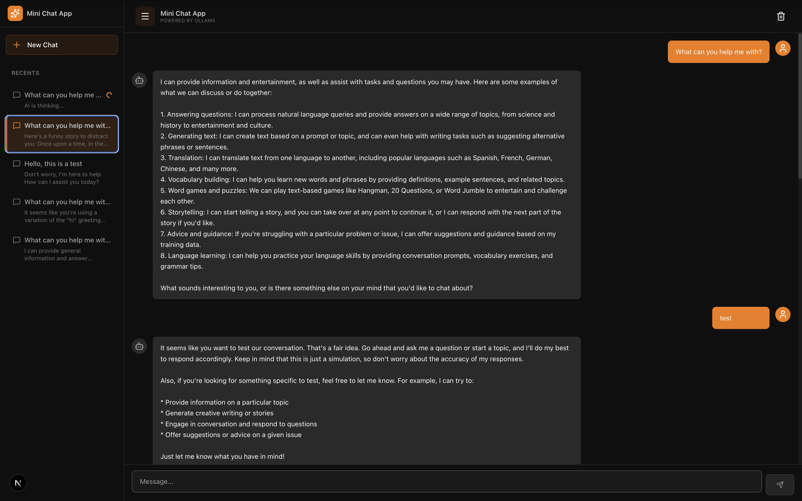
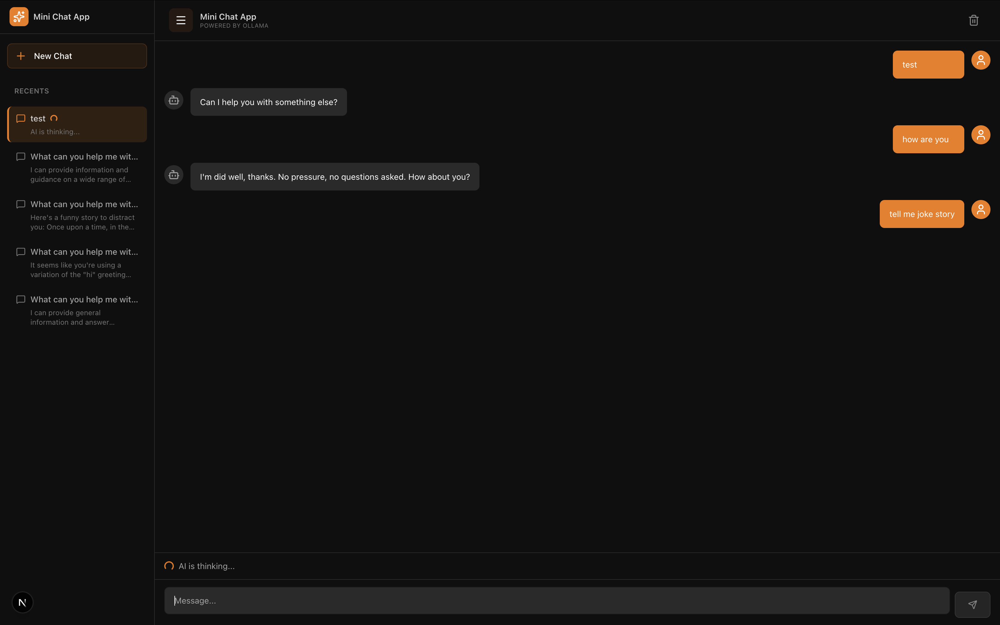
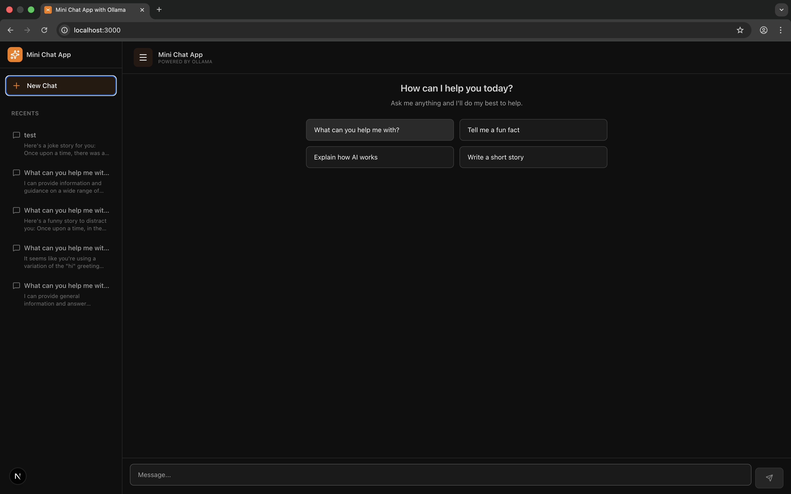
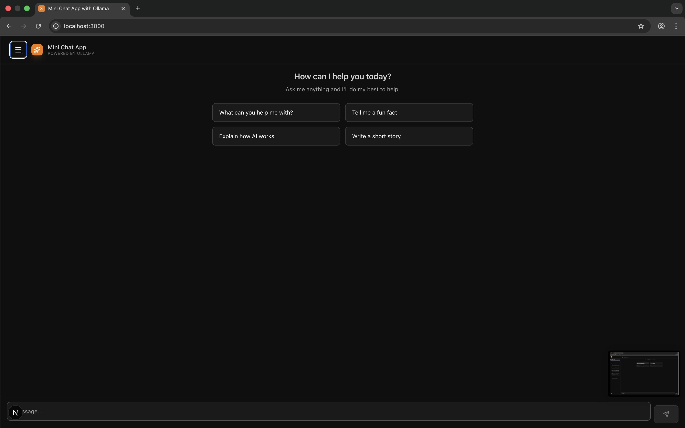
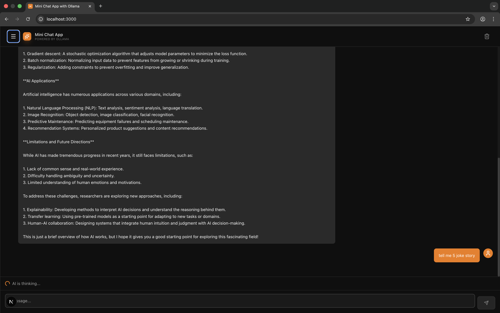
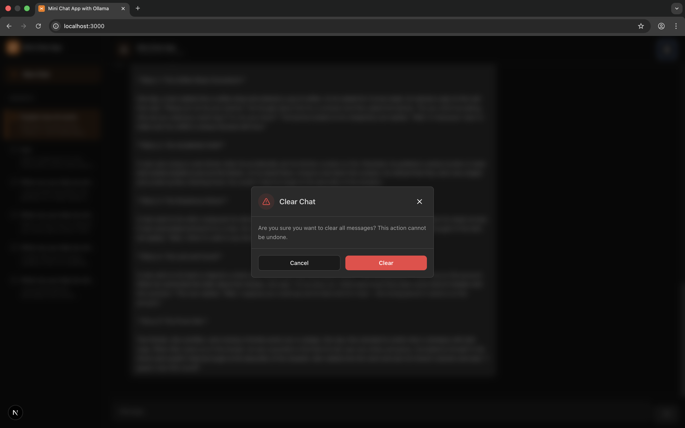
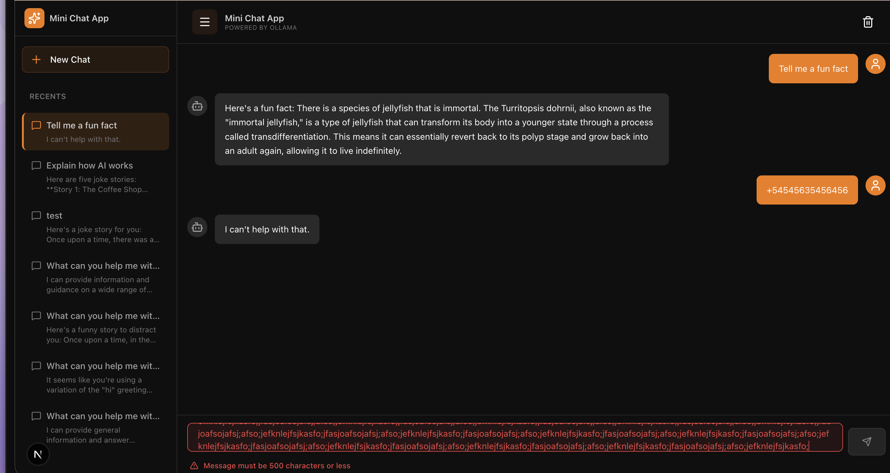

# Mini Chat App with Ollama

A real-time chat application powered by Ollama AI for intelligent conversations.

## 🛠 Tech Stack

- **Frontend**: Next.js 14 (TypeScript)
- **Backend**: Node.js + Express (TypeScript)
- **Database**: MongoDB
- **AI Integration**: Ollama (Local LLM)
- **Architecture**: Monorepo with npm workspaces

## 📋 Prerequisites

Before starting, make sure you have installed:

1. **Node.js** (v18 or higher) and npm
2. **MongoDB** (local or cloud)
3. **Ollama** - Download from [ollama.ai](https://ollama.ai)

## 🚀 Setup Instructions

### Step 1: Install and Run Ollama

1. **Download and Install Ollama**
   - Visit [ollama.ai](https://ollama.ai) and download Ollama for your operating system
   - Follow the installation instructions

2. **Start Ollama Service**
   - Ollama runs automatically as a service after installation
   - It will be available at `http://localhost:11434` by default
   - Verify it's running:
     ```bash
     curl http://localhost:11434/api/tags
     ```

3. **Download a Model**
   - For faster responses, use a smaller model:
     ```bash
     ollama pull llama3.2:1b
     ```
   - Or use other models:
     ```bash
     ollama pull llama3.2
     ollama pull mistral
     ollama pull phi3:mini
     ```

4. **Verify Model Installation**
   ```bash
   ollama list
   ```

### Step 2: Install Dependencies

```bash
# Install dependencies for both frontend and backend
npm install
```

### Step 3: Configure Environment Variables

#### Backend Environment Variables

Create a `.env` file in the `backend/` directory:

```env
# MongoDB Connection
MONGODB_URI=mongodb://localhost:27017/realtime-chat

# Ollama API URL
OLLAMA_API_URL=http://localhost:11434

# Ollama Model (must match a model you've pulled)
OLLAMA_MODEL=llama3.2:1b

# Server Port
PORT=3001
```

**Required Variables:**
- `MONGODB_URI` - MongoDB connection string (required)
- `OLLAMA_API_URL` - Ollama API URL (optional, default: http://localhost:11434)
- `OLLAMA_MODEL` - Model name from `ollama list` (optional, default: llama3.2:1b)
- `PORT` - Backend server port (optional, default: 3001)

#### Frontend Environment Variables

Create a `.env.local` file in the `frontend/` directory:

```env
# Backend API URL
NEXT_PUBLIC_API_URL=http://localhost:3001
```

**Required Variables:**
- `NEXT_PUBLIC_API_URL` - Backend API URL (required)

### Step 4: Start MongoDB

**Option A: Local MongoDB**

```bash
# macOS (with Homebrew)
brew services start mongodb-community

# Linux
sudo systemctl start mongod

# Windows
net start MongoDB
```

**Option B: MongoDB Atlas (Cloud)**

1. Create an account at [MongoDB Atlas](https://www.mongodb.com/cloud/atlas)
2. Create a new cluster
3. Get your connection string
4. Update `MONGODB_URI` in `backend/.env`

### Step 5: Run the Application

#### Option 1: Run Separately (Recommended for Development)

**Terminal 1 - Backend:**
```bash
npm run dev:backend
```

**Terminal 2 - Frontend:**
```bash
npm run dev:frontend
```

#### Option 2: Run Together

```bash
npm run dev
```

### Step 6: Open in Browser

Open your browser and navigate to: [http://localhost:3000](http://localhost:3000)

## 📸 Screenshots

### Main Chat Interface


### Sidebar Menu


### New Chat Conversation


### AI Response and interaction


### Conversation History


### Multiple Sessions


### Error Validation - Message Length Limit


## 📁 Project Structure

```
realtime-chat/
├── frontend/              # Next.js application
│   ├── app/              # Next.js app directory
│   │   ├── page.tsx     # Main chat page
│   │   ├── layout.tsx   # Root layout
│   │   └── globals.css  # Global styles
│   ├── components/       # React components
│   │   ├── ChatContainer.tsx
│   │   ├── ChatMessage.tsx
│   │   ├── ChatInput.tsx
│   │   ├── LeftSidebar.tsx
│   │   ├── LoadingIndicator.tsx
│   │   └── ConfirmModal.tsx
│   ├── hooks/            # Custom React hooks
│   │   ├── useChat.ts
│   │   └── useAutoScroll.ts
│   ├── lib/             # Utilities
│   │   ├── api.ts       # API client
│   │   └── constants.ts # Constants
│   └── types/           # TypeScript types
│       └── chat.ts
├── backend/              # Express server
│   ├── src/
│   │   ├── server.ts    # Express app entry
│   │   ├── routes/      # API routes
│   │   │   └── chat.ts   # Chat endpoints
│   │   ├── models/      # MongoDB models
│   │   │   └── Message.ts
│   │   ├── services/    # Business logic
│   │   │   └── ollama.ts # Ollama integration
│   │   ├── config/      # Configuration
│   │   │   └── database.ts
│   │   ├── constants.ts # Constants
│   │   └── types/       # TypeScript types
│   │       └── index.ts
│   └── .env            # Environment variables
└── package.json        # Root workspace config
```

## 🔌 API Endpoints

### GET `/api/messages`
Fetch all messages from the database.

**Query Parameters:**
- `sessionId` (optional): Filter by session ID

**Response:**
```json
{
  "messages": [
    {
      "id": "...",
      "role": "user",
      "content": "Hello",
      "createdAt": "2024-01-01T00:00:00.000Z"
    }
  ]
}
```

### POST `/api/messages`
Send a user message and get AI response.

**Request:**
```json
{
  "content": "Hello, how are you?",
  "sessionId": "optional-session-id"
}
```

**Response:**
```json
{
  "sessionId": "...",
  "userMessage": {
    "id": "...",
    "role": "user",
    "content": "Hello, how are you?",
    "createdAt": "2024-01-01T00:00:00.000Z"
  },
  "aiMessage": {
    "id": "...",
    "role": "ai",
    "content": "Hello! I'm doing well, thank you...",
    "createdAt": "2024-01-01T00:00:00.000Z"
  }
}
```

### DELETE `/api/messages`
Delete all messages or messages for a specific session.

**Query Parameters:**
- `sessionId` (optional): Delete messages for specific session

**Response:**
```json
{
  "message": "All messages cleared",
  "deletedCount": 10
}
```

### GET `/api/sessions`
Get all conversation sessions.

**Response:**
```json
{
  "sessions": [
    {
      "id": "...",
      "title": "First message...",
      "messageCount": 10,
      "lastMessage": "Last message content...",
      "createdAt": "2024-01-01T00:00:00.000Z"
    }
  ]
}
```

## ✨ Features

- ✅ Real-time chat interface with message bubbles
- ✅ Separate user and AI messages
- ✅ Conversation history stored in MongoDB
- ✅ Multiple sessions/conversations support
- ✅ Loading indicator while waiting for AI response
- ✅ Message length limit (500 characters)
- ✅ Comprehensive error handling
- ✅ Auto-scroll to latest message
- ✅ Clear chat button with confirmation modal
- ✅ Responsive design
- ✅ Dark theme UI
- ✅ Sidebar with conversation history

## 🔒 Required Environment Variables

### Backend (`.env` in `backend/`)

| Variable | Required | Default | Description |
|----------|----------|---------|-------------|
| `MONGODB_URI` | ✅ Yes | - | MongoDB connection string |
| `OLLAMA_API_URL` | ❌ No | `http://localhost:11434` | Ollama API URL |
| `OLLAMA_MODEL` | ❌ No | `llama3.2:1b` | Model name from `ollama list` |
| `PORT` | ❌ No | `3001` | Backend server port |

### Frontend (`.env.local` in `frontend/`)

| Variable | Required | Default | Description |
|----------|----------|---------|-------------|
| `NEXT_PUBLIC_API_URL` | ✅ Yes | - | Backend API URL |

## 🐛 Troubleshooting

### Ollama Connection Issues

1. **Check if Ollama is running:**
   ```bash
   curl http://localhost:11434/api/tags
   ```
   If this fails, start Ollama service.

2. **Verify model is installed:**
   ```bash
   ollama list
   ```
   Make sure the model name in `.env` matches one from this list.

3. **Download the model if missing:**
   ```bash
   ollama pull llama3.2:1b
   ```

4. **Check Ollama logs:**
   - macOS: Check Console.app or `~/Library/Logs/Ollama/`
   - Linux: Check system logs
   - Windows: Check Event Viewer

### MongoDB Connection Error

1. **Check if MongoDB is running:**
   ```bash
   # macOS/Linux
   brew services list
   # or
   sudo systemctl status mongod
   ```

2. **Verify connection string:**
   - Check `MONGODB_URI` in `backend/.env`
   - Format: `mongodb://localhost:27017/realtime-chat`

3. **MongoDB Atlas:**
   - Ensure your IP address is whitelisted
   - Check connection string includes authentication

### Frontend Cannot Connect to Backend

1. **Verify backend is running:**
   - Check terminal for backend server logs
   - Backend should be on port 3001

2. **Check environment variable:**
   - Verify `NEXT_PUBLIC_API_URL` in `frontend/.env.local`
   - Should be `http://localhost:3001`

3. **Check CORS settings:**
   - Backend CORS is configured to allow frontend origin
   - Check browser console for CORS errors

### Model Response Too Slow

1. **Use a smaller model:**
   ```bash
   ollama pull llama3.2:1b
   ollama pull phi3:mini
   ollama pull tinyllama
   ```

2. **Update model in `.env`:**
   ```env
   OLLAMA_MODEL=llama3.2:1b
   ```

## 📝 Development

### Build for Production

```bash
# Build frontend
npm run build:frontend

# Build backend
npm run build:backend
```

### Start Production Server

```bash
# Backend
cd backend
npm start

# Frontend
cd frontend
npm start
```

## 📄 License

MIT

## 🤝 Contributing

Pull requests are welcome! For major changes, please open an issue first to discuss what you would like to change.

## 📧 Support

If you encounter any issues or have questions, please open an issue in the GitHub repository.

---

**Happy Chatting! 💬**
